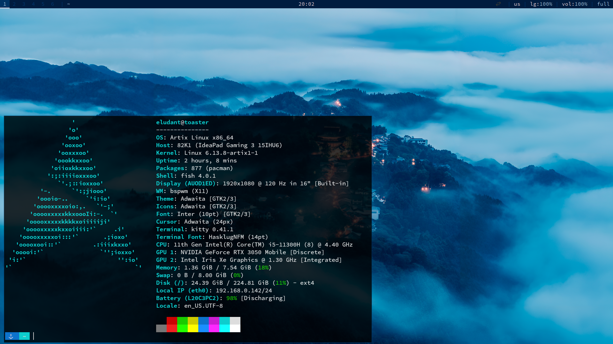

# Dotfiles
my dotfiles for personal use,
subject to change later,

a lot of inspiration for nvim
comes from theprimeagen

---

## Needed Dependencies

The programs that i use:
    - bspwm & sxhkd
    - rofi
    - feh
    - dunst
    - kitty
    - nvim
    - tmux
    - Inter and Hasklug fonts
    - picom
    - sddm (with qt5 for the theme)
    - nwg-look(optional, to change themes/cursor)
    - fish
    - scrot
    - brightnessctl
    - pactl (pulseaudio)

---

## Preview

