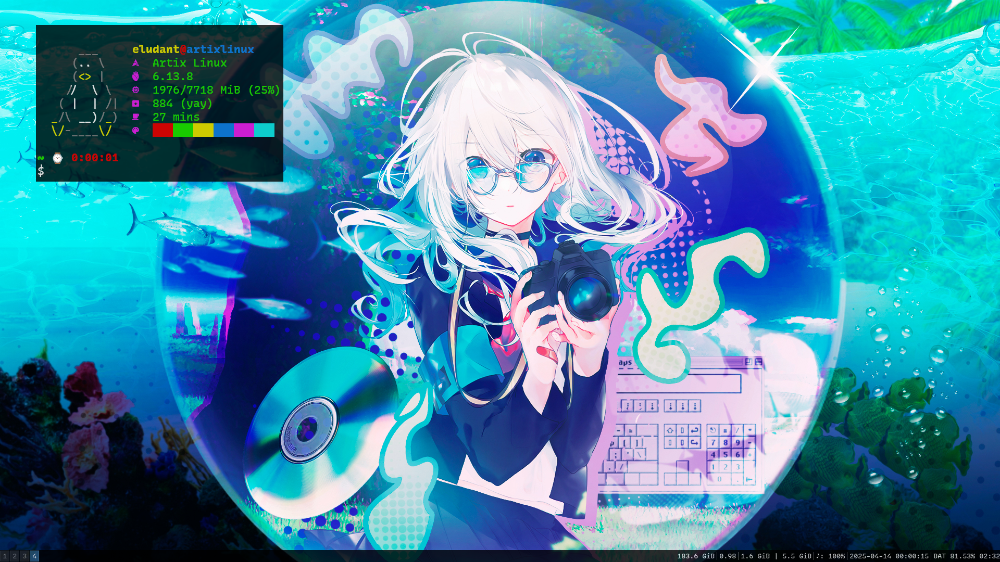

# i3wm-Dotfiles

my personal dotfiles, do not recommend using it because its very amateur,
but free to do whatever you want.

> [!WARNING]
> The Dotfiles are subject to constant change
> and there is a chance of me deprecating them.

## Dependencies

-i3wm (of course)
-rofi
-feh
-picom (i use picom-simpleanims-git from AUR)
-kitty
-brave
-pipewire, pipewire-pulse, wireplumber (sound system)
-sddm (the theme i use requires Qt5)
-zsh (i use oh-my-zsh)
-emacs
-betterlockscreen
-brightnessctl
-maim
-xclip
-thunar (used as a basic explorer)
-lxappearance (used to set themes and icons)

## Preview

